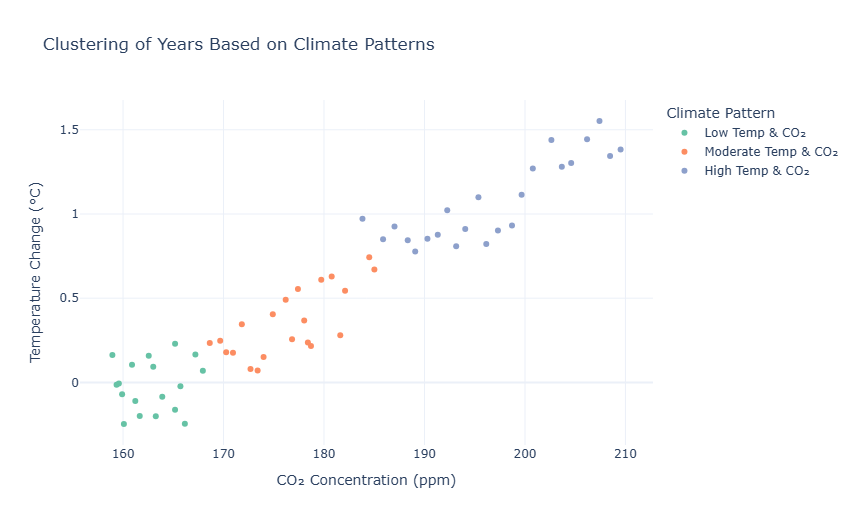

# Carbon Emissions Impact Analysis

This project analyzes global carbon emissions using Python, helping uncover trends and insights related to climate change. The dataset contains country-wise CO₂ emissions data over time, which is explored and visualized to understand the environmental impact.

---

## Project Overview

The aim of this project is to:

- Analyze global CO₂ emissions data
- Visualize emissions trends over time
- Identify the top contributors to carbon emissions
- Explore year-wise and country-wise patterns
- Raise awareness about environmental sustainability through data-driven insights

---

## Technologies Used

- **Python** 
- **Pandas**
- **Matplotlib & Seaborn** 
- **Jupyter Notebook** 

---

## Dataset
Check out the dataset from:
1. `carbon_emmission.csv` One containing annual temperature changes across multiple countries and decades,
2. `temperature.csv`Another featuring monthly CO₂ concentrations measured globally.
Combine these datasets 

---

## How to Run

1. Clone the repository:

```bash
git clone https://github.com/veydantkatyalcarbon-emissions-analysis.git
cd carbon-emissions-analysis
```
2. Install dependencies:

```bash
pip install pandas matplotlib seaborn
```
3. Run the jupyter Notebook:

```bash
jupyter notebook Carbon_Emissions_Analysis.ipynb
```
---

## Key Visualisations
- Top 10 countries with highest carbon emissions
- Year-wise trend of global CO₂ emissions
- CO₂ emissions heatmap
- Country-specific emissions over time

---

## Insights Derived
- Developed a deeper understanding of how different countries contribute to global carbon emissions.
- Identified patterns such as rapid growth in emissions from emerging economies.
- Raised awareness about sustainable practices and the importance of reducing our carbon footprint.

---

This project is open-source and available under the [MIT License](https://github.com/veydantkatyal/carbon-emission-analysis/blob/main/LICENSE)
